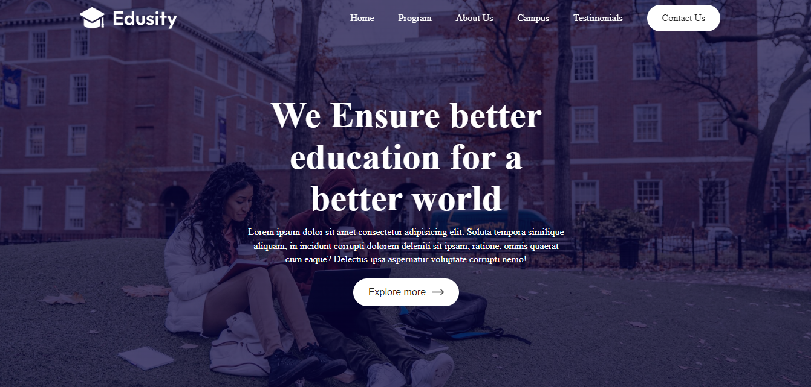

# 🎓 Edusity - Online Education Platform

<<<<<<< HEAD
Welcome to **Edusity**, a modern and responsive web application for learning, built with React.js.

## 🚀 Live Website

🌐 [Visit Edusity](https://edusity-978cc.web.app/)

## 📸 Preview

## 🛠️ Tech Stack

- **Frontend**: React, Vite, Tailwind CSS
- **Hosting**: Firebase Hosting

## 📂 Features

- ✅ Course Browsing  
- ✅ Responsive Design  
- ✅ Firebase Hosted
=======
Welcome to **Edusity**, a modern and responsive web application for learning, built with the Reactjs.

## 🚀 Live Website

🌐 [Visit Edusity](https://edusity-978cc.web.app/)

## 🛠️ Tech Stack

- **Frontend**: React, Vite, Tailwind CSS (or whatever you used)
- **Hosting**: Firebase Hosting

## 📂 Features

- ✅ Course Browsing
- ✅ Responsive Design
- ✅ Firebase Hosted
